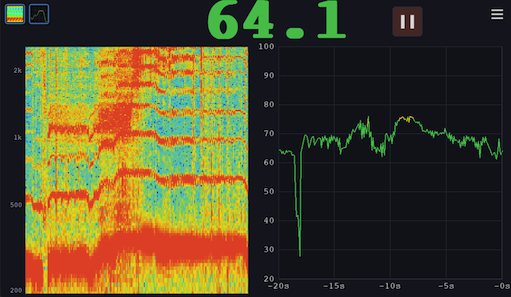

# pi-audio

Real-time sound level meter, spectrogram, and pitch detector for Raspberry Pi with A-weighted SPL measurement, rolling history, FFT-based overtone analysis, and YIN-based pitch detection.



## Features

- **Live SPL(A) Measurement** - Real-time A-weighted sound pressure level in dB
- **Rolling History Chart** - Configurable visual history of sound levels (5s to 5min)
- **Spectrogram / Overtone Analyzer** - Scrolling frequency display with logarithmic Y-axis and configurable frequency range (40 Hz–8 kHz)
- **Pitch Detection** - Real-time fundamental pitch detection using the YIN algorithm with note name, octave, cents deviation, and piano-roll history chart
- **Flexible Panel Layout** - Toggle up to two panels at once from three types (Overtones, Meter, Pitch), or show current values only
- **In-App Help** - Built-in help overlay accessible from the menu
- **Persistent Settings** - History length, color thresholds, frequency range, and display mode saved across sessions
- **Hardware Flexibility** - Designed to work with various Pi models, displays, and USB microphones

## Quick Start

### Prerequisites

- Raspberry Pi (tested on Pi 5, should work on Pi 4)
- HDMI display (any resolution)
- USB microphone
- Raspberry Pi OS (64-bit) Desktop

### Installation

```bash
# Clone the repository
git clone <your-repo-url> pi-audio
cd pi-audio

# Install dependencies (requires uv - see setup guide if not installed)
uv sync

# Run the application
uv run python -m pi_audio
```

## Hardware Setup

For detailed setup instructions including OS installation, audio configuration, and display setup, see:

**[HARDWARE.md](HARDWARE.md)** - Tested hardware configurations

**Tested Configuration:**
- Raspberry Pi 5 + Hosyond 7" Display + MillSO USB Mic
- Full setup guide: [docs/hardware-configs/rpi5-hosyond-millso.md](docs/hardware-configs/rpi5-hosyond-millso.md)

## Development

```bash
# Lint code
uv run ruff check src/
uv run ruff format --check src/

# Format code
uv run ruff format src/
```

### Deploying to Pi

To deploy changes to your Raspberry Pi:

```bash
# Sync files to Pi
./deploy.sh

# Sync and run the app on Pi
./deploy.sh --run
```

**Configuration:** Set environment variables to override defaults:
```bash
PI_HOST=pi@mypi.local PI_PATH=~/my-path ./deploy.sh
```

Default values: `PI_HOST=admin@piaudio.local`, `PI_PATH=~/pi-audio`

## Project Structure

- `src/pi_audio/config.py` - Display, audio, color, and spectrogram constants
- `src/pi_audio/audio.py` - Audio capture, A-weighted SPL calculation, and FFT computation
- `src/pi_audio/pitch.py` - YIN-based pitch detection (frequency, note name, cents deviation)
- `src/pi_audio/spectrogram.py` - Spectrogram renderer (log-frequency mapping, color LUT)
- `src/pi_audio/settings.py` - Persistent user settings
- `src/pi_audio/main.py` - pygame initialization and main loop
- `src/pi_audio/screens/` - Screen implementations (meter, settings)

## How It Works

1. **Audio Capture** - Uses `sounddevice` to capture audio from the default ALSA device
2. **A-Weighting Filter** - Applies IEC 61672:2003 A-weighting filter to match human hearing perception
3. **SPL Calculation** - Converts RMS amplitude to dB SPL with calibration reference
4. **FFT Analysis** - Applies Hann window and computes FFT on each audio block for spectrogram data
5. **Pitch Detection** - YIN algorithm estimates fundamental frequency from raw audio with sub-sample accuracy
6. **Display** - pygame renders current level, rolling history chart, spectrogram, and/or pitch panel based on active toggles

## Contributing

Contributions welcome! Especially:
- New hardware configuration documentation
- Calibration improvements
- UI enhancements

## License

See [LICENSE](LICENSE) file for details.
